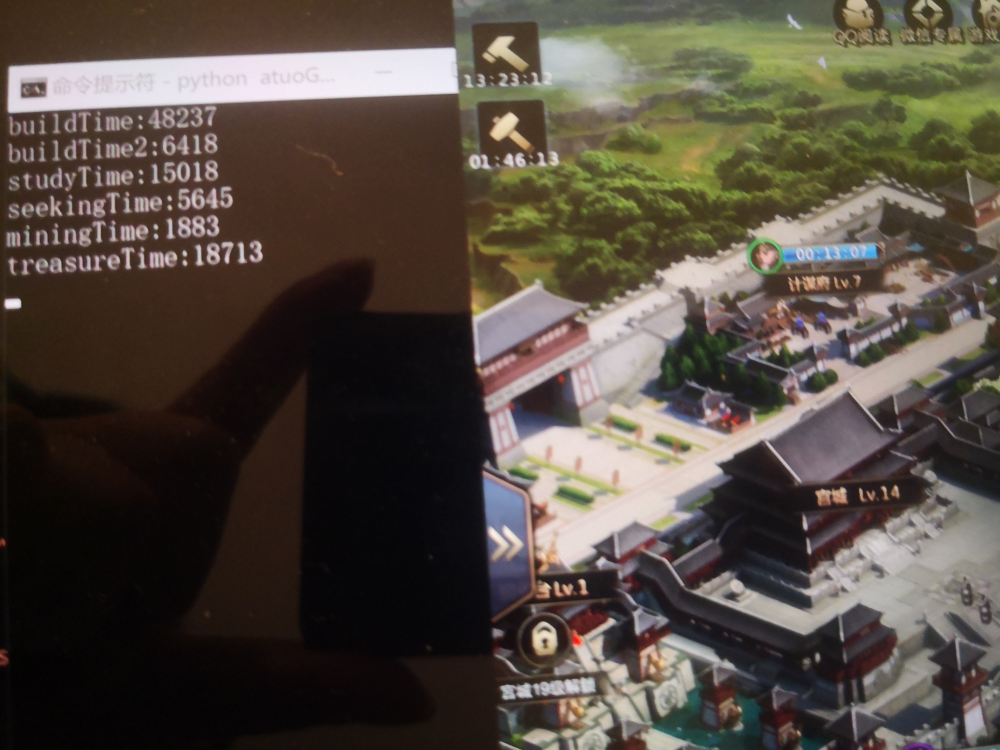

# automaticGameAssistant
这是一个三国群英传-霸王之业的全自动肝助手。 

开发环境：win10-64bit python3.7.3 
主要依赖： 
opecv4.0.1 
adb 
tesseract 

其实思路很简单，adb负责电脑和手机的沟通，opencv负责匹配相应按键的位置，tesseract是一个本地文字识别库，因为一些地方还是要理解游戏按键的意思才能进行下一步操作。 
不想花费太多时间搞这个，程序写的仓促，稳定性不错但是相应的失去了速度，还好这是个不要速度的游戏（狗头）。 
使用方法： 
    step1:下载dependencies里面的platform文件，解压到C盘，并将解压的路径设置到环境变量，打开命令行输入adb -v 看到相关信息即可;安装python;pip install opencv-python;官网下载tesseract安装,然后pip install pytesseract 
    step2:下载一个雷电手机模拟器，分辨率设置为1080*2160，分辨率一定要正确，下载游戏并进入 
    step3:clone文件到本地。打开命令行，进入文件夹，输入"python autoGame.py" 
    step5:此时就可以看到脚本会经过一段时间的运行后就自动监测各个项目剩余时间，并在时间结束后再次进行操作 
     
    step6:游戏愉快！ 
效果参看videoDemo文件 
